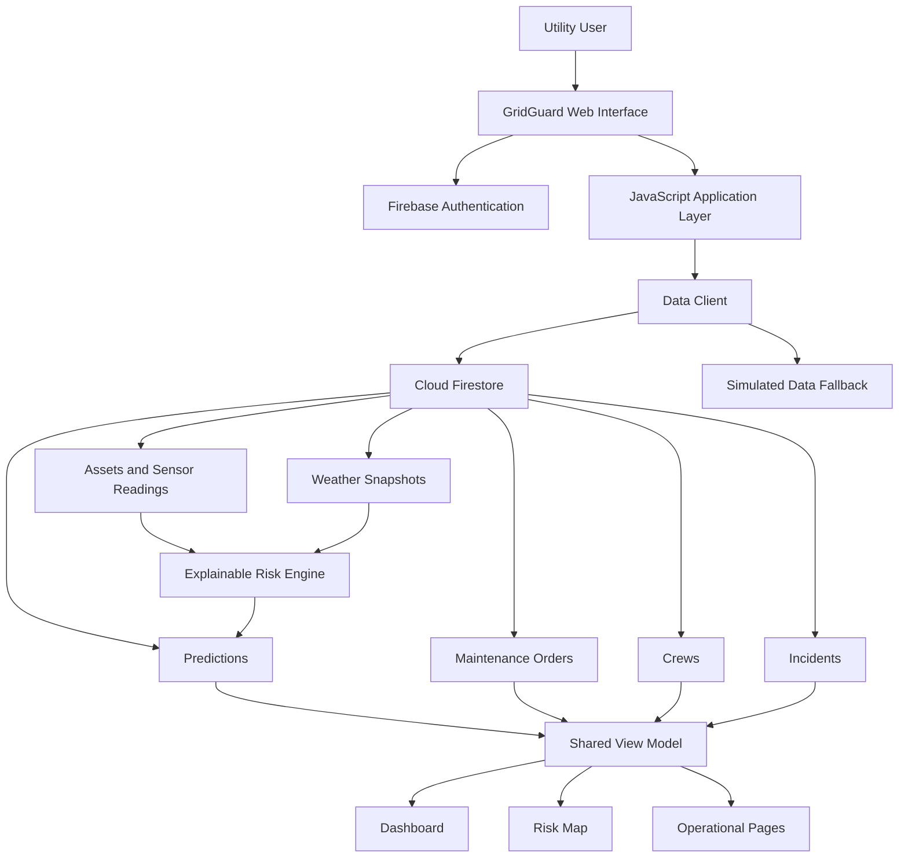

# Architecture

## System Architecture

GridGuard AI uses a browser-based multi-page frontend connected to Firebase services. Operational records are stored in Cloud Firestore, authentication is handled by Firebase Authentication, and authorization is enforced through Firestore Security Rules.



## Components

| Component | Technology | Responsibility |
|---|---|---|
| Frontend | HTML5, CSS3, JavaScript | Multi-page operational interface |
| Build Tool | Vite | Development and production bundling |
| Authentication | Firebase Authentication | Email/password authentication and sessions |
| Database | Cloud Firestore | Persistent operational records |
| Authorization | Firestore Security Rules | Server-side role-based access control |
| Risk Engine | JavaScript | Explainable multi-factor weighted risk scoring |
| Mapping | Leaflet + OpenStreetMap | Geographic grid-risk visualization |
| Testing | Playwright + automated tests | Browser, workflow, rules and logic validation |
| Development Assistance | IBM Bob | Code inspection, implementation, debugging and validation |

## Data Model

GridGuard uses the following primary Firestore collections:

- `users`
- `regions`
- `assets`
- `sensorReadings`
- `predictions`
- `maintenanceOrders`
- `crews`
- `incidents`
- `weatherSnapshots`

Operational pages consume shared Firestore-backed state instead of maintaining independent regional datasets.

## Risk Assessment

The prototype uses an explainable weighted risk model based on applicable signals including:

- Equipment temperature
- Oil temperature
- Vibration
- Partial discharge
- Oil quality and degradation
- Equipment load
- Historical incident count
- Weather exposure

The model produces a 0–100 risk score and assigns one of three classifications:

- Stable
- Elevated
- Critical

The system also exposes supporting evidence and recommended actions so operators can understand why an asset was prioritized.

The score is a hackathon decision-support heuristic and is not presented as a calibrated production failure probability.

## Operational Workflow

```text
Telemetry / Asset Data
        ↓
Risk Evaluation
        ↓
Prediction & Prioritization
        ↓
Dashboard / Geographic Risk Map
        ↓
Maintenance Work Order
        ↓
Field Supervisor Crew Assignment
        ↓
Maintenance Engineer Execution
        ↓
Completion / Continued Monitoring
```

Incidents are tracked alongside this workflow so operators can connect grid events with affected assets and current risk information.

## Role-Based Authorization

GridGuard separates responsibilities into five roles:

| Role | Main Responsibility |
|---|---|
| `admin` | Utility administration and full management access |
| `operator` | Grid operations, telemetry, work-order creation and incident management |
| `field_supervisor` | Assign Ready crews to Pending work orders |
| `maintenance` | Start and complete assigned maintenance work |
| `reliability` | Read-only reliability monitoring |

Frontend controls reflect the user's role, while Firestore Security Rules provide the authoritative server-side authorization layer.

## Resilience

Firebase and Cloud Firestore are the primary data services. GridGuard also contains a clearly identified simulated-data fallback for demonstration resilience when Firebase is unavailable because of network or service-quota limitations.

Fallback operations are not presented as Firestore persistence.

## Security

- Anonymous operational access is denied.
- Authentication uses Firebase Authentication.
- User roles are stored in user profiles.
- Firestore Security Rules enforce permitted operations.
- Browser users cannot arbitrarily modify protected telemetry and risk records.
- No private Firebase service-account key is included in the frontend repository.
- Local environment configuration is excluded from Git.

## Repository Structure

```text
Repository
├── src/             # Complete GridGuard application
├── docs/            # Submission documentation
├── demo/            # Demo links and screenshots
├── presentation/    # Presentation
├── README.md
└── submission.yaml
```# Architecture

## System Architecture

GridGuard AI uses a browser-based multi-page frontend connected directly to Firebase services. Operational records are stored in Cloud Firestore, authentication is handled by Firebase Authentication, and authorization is enforced through Firestore Security Rules.

```mermaid
graph TD
    U[Utility User] --> UI[GridGuard Web Interface]

    UI --> AUTH[Firebase Authentication]
    UI --> APP[JavaScript Application Layer]

    APP --> DC[Data Client]
    DC --> FS[Cloud Firestore]
    DC --> FALLBACK[Simulated Data Fallback]

    FS --> ASSETS[Assets & Sensor Readings]
    FS --> PRED[Predictions]
    FS --> MAINT[Maintenance Orders]
    FS --> CREWS[Crews]
    FS --> INC[Incidents]
    FS --> WEATHER[Weather Snapshots]

    ASSETS --> RISK[Explainable Risk Engine]
    WEATHER --> RISK
    RISK --> PRED

    PRED --> VM[Shared View Model]
    MAINT --> VM
    CREWS --> VM
    INC --> VM

    VM --> DASH[Dashboard]
    VM --> MAP[Risk Map]
    VM --> OPS[Operational Pages]

    FS --> RULES[Firestore Security Rules]
